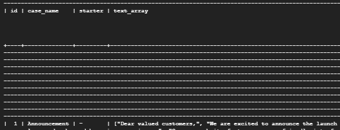

# CC-API
Version: MySQL 5.7

### Users

Instance: communicare 
Database: users 
Table: users 
 
Config app.yaml: 
  DB_USER: "root" 
  DB_NAME: "users" 
  DB_PASS: "" 
  DB_INSTANCE_UNIX_SOCKET:  
  "/cloudsql/(NAMAPROJECT):(REGION):(INSTANCE)" 
    ex: 
  "/cloudsql/communicare-388309:us-central1:communicare" 
 
### Script 
 

Instance: communicare 
Database: script 
Table: script 
 
Config app.yaml: 
  DB_USER: "root" 
  DB_NAME: "script" 
  DB_PASS: "" 
  DB_INSTANCE_UNIX_SOCKET:  
  "/cloudsql/(NAMAPROJECT):(REGION):(INSTANCE)" 
  ex: 
  "/cloudsql/communicare-388309:us-central1:communicare" 
